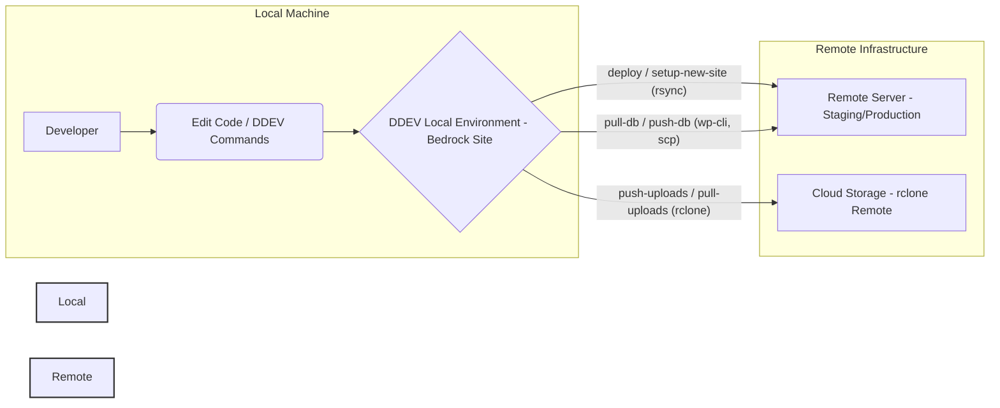

<div align="center">
    <h1>Site WordPress Bedrock Environment (DDEV Edition)</h1>
    <!-- Add a relevant logo/icon if available, otherwise omit or use a generic one -->
    <!--  -->
</div>

## Quick Start ⚡

**Note:** Local site creation and provisioning now use
[DDEV](https://ddev.readthedocs.io/en/latest/). DDEV manages Docker containers,
networking, and environment settings for you.

Clone the repo and create your first site:

```sh
git clone git@github.com:satusdev/bedrock-forge.git
cd bedrock-forge

# Create a new site directory
cd /home/nadbad/Work/Wordpress
mkdir site
cd site

# Configure DDEV for WordPress with Bedrock's docroot
ddev config --project-type=wordpress --docroot=web --create-docroot

# Install Bedrock via Composer
composer create-project roots/bedrock .

# Start the DDEV project
ddev start

# Provision WordPress with WP-CLI
ddev wp core install --url=https://site.ddev.site --title="My Site" --admin_user=admin --admin_email=admin@example.com --admin_password=securepassword

# Launch the site in your browser
ddev launch
```

See [docs/local-development.md](docs/local-development.md) and
[docs/example-workflow.md](docs/example-workflow.md) for full step-by-step
guides.

## Modular Workflow 🚀

This project uses a modular workflow for all provisioning, deployment, sync, and
monitoring tasks:

- **Local Site Creation:** DDEV-based workflow (see above)
- `scripts/provision/provision-cyberpanel.sh` — Provision CyberPanel/Hetzner
  server
- `scripts/deploy/deploy.sh` — Deploy code to remote server
- `scripts/sync/sync-db.sh` — Sync database (push/pull)
- `scripts/sync/sync-uploads.sh` — Sync uploads (push/pull)
- `scripts/sync/rclone-gui.sh` — Launch rclone web GUI
- `scripts/provision/kuma-monitor.sh` — Kuma monitoring integration
- `scripts/deploy/jenkins/Jenkinsfile` — Jenkins CI/CD pipeline

**Usage Examples:**

```sh
# Provision server
./scripts/provision/provision-cyberpanel.sh mysite.com

# Deploy code
./scripts/deploy/deploy.sh site staging

# Sync database
./scripts/sync/sync-db.sh site staging push   # push local → remote
./scripts/sync/sync-db.sh site staging pull   # pull remote → local

# Sync uploads
./scripts/sync/sync-uploads.sh site staging push
./scripts/sync/sync-uploads.sh site staging pull

# Launch rclone GUI
./scripts/sync/rclone-gui.sh

# Kuma monitoring
./scripts/provision/kuma-monitor.sh add site.com
```

## Overview ⏩️

This project provides a DDEV-based development environment designed to manage
multiple WordPress sites using the Bedrock boilerplate. It features:

- **DDEV Local Environment:** Easily create and manage Bedrock sites with DDEV.
- **Site Template:** Use Bedrock's composer template for new sites.
- **Unified Management Scripts:** Provision, deploy, sync, and monitor sites
  with modular scripts.

**High-Level Workflow:**



## Table of Contents 📄

- [Project Structure](#project-structure-)
- [Requirements](#requirements-%EF%B8%8F)
- [Documentation](#documentation-)
- [Migration from Legacy Scripts](#migration-from-legacy-scripts)
- [Further Automation Ideas](#further-automation-ideas-)
- [Getting Help](#getting-help-)
- [Quick Start](#quick-start-)

## Documentation 📖

Detailed documentation is available in the `docs/` directory:

- **[Project Info Display](./scripts/show-project-info.sh):** Print all
  collected project metadata in a readable format.
- **[Backup & Restore Usage](./docs/usage-backup.md):** How to use backup and
  restore scripts.

## Migration from Legacy Scripts

If you previously used this project with monolithic scripts (e.g.,
`manage-site.sh`, `create-site.sh`, `switch-env.sh`), please note:

**Legacy scripts removed:**

- Local site creation and management now use DDEV.
- Modular scripts remain for provisioning, deployment, sync, and backup tasks.

**Migration checklist:**

1. Use DDEV for all local site creation and management.
2. Use modular scripts for provisioning, deployment, sync, and backup.
3. Update any automation or CI/CD jobs to use the modular scripts.
4. Review and update your `config/sync-config.json` as needed.
5. Refer to the updated docs and usage examples below.

For a full mapping of old commands to new modular equivalents, see
[docs/example-workflow.md](docs/example-workflow.md).

## Project Structure 🏗️

```
.
├── core/                     # Shared configs (DB, Base Image)
│   ├── .env.example
│   ├── docker-compose-db.yml
│   └── Dockerfile
├── config/                   # Central config (sync-config.json, envs)
│   ├── .env.local
│   ├── .env.production
│   └── sync-config.json
├── scripts/
│   ├── provision/            # Provisioning (server, DNS, hardening, rclone, etc.)
│   ├── deploy/               # Deployment (deploy.sh, Jenkinsfile, etc.)
│   ├── sync/                 # Sync/backup (db, uploads, backup, restore, rclone GUI)
│   ├── ci/                   # Jenkins pipeline registration
│   ├── monitoring/           # Kuma monitor registration
│   ├── common/               # Shared helpers (logging, config, utils)
│   └── logs/                 # Log files (rotated by logrotate)
├── docs/                     # Documentation (concepts, usage, migration, workflow)
├── .env.example
├── .gitignore
├── Makefile                  # Shortcuts for legacy Docker tasks (deprecated)
├── nginx.conf                # Default Nginx config (referenced by site configs)
└── README.md
```

## Requirements ⏸️

**Local Machine:**

- [DDEV](https://ddev.readthedocs.io/en/latest/)
- [Composer](https://getcomposer.org/)
- [Hetzner hcloud CLI](https://github.com/hetznercloud/cli) (required for server
  provisioning)
- [Cloudflare CLI](https://github.com/cloudflare/cloudflare-go) (required for
  DNS automation)
- `git`
- `rclone` (Required for uploads sync)
- `rsync` (Required for deployment)
- `ssh` & `scp` clients (Required for deployment/sync)

## Getting Help 🆘

- Refer to [docs/local-development.md](docs/local-development.md) for DDEV setup
  and troubleshooting.
- Refer to documentation for Bedrock, DDEV, WP-CLI, rclone, jq.
- Check the Roots Discourse for Bedrock questions: https://discourse.roots.io/
