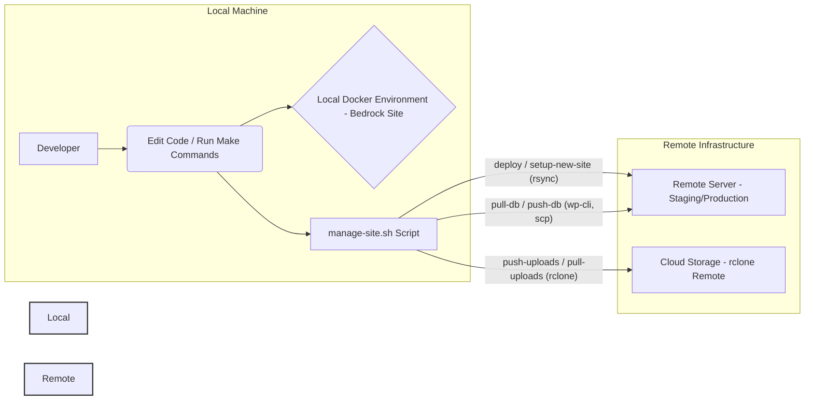

<div align="center">
    <h1>Site WordPress Docker/Bedrock Environment</h1>
    <!-- Add a relevant logo/icon if available, otherwise omit or use a generic one -->
    <!--  -->
</div>

## Quick Start ⚡

Clone the repo, make scripts executable, and create your first site:

```sh
git clone git@github.com:satusdev/bedrock-forge.git
cd bedrock-forge
find scripts -type f -name "*.sh" -exec chmod +x {} \;

# Create a new site
./scripts/local/site-init.sh mysite --port=8001

# Provision Hetzner server (requires hcloud CLI)
hcloud context create my-hcloud
hcloud context use my-hcloud
hcloud server create --name mysite-server --type cx22 --image ubuntu-22.04 --location nbg1 --ssh-key mykey

# Setup CyberPanel and DNS (requires Cloudflare CLI)
./scripts/provision/provision-cyberpanel.sh mysite.com
./scripts/provision/cloudflare-dns.sh add --zone mysite.com --type A --name www --content <server-ip>
```

See [docs/example-workflow.md](docs/example-workflow.md) for a full step-by-step
guide.

## Modular Workflow 🚀

This project now uses a modular script workflow for all local, deployment, sync,
and provisioning tasks:

- `scripts/local/site-init.sh` — Create a new local Bedrock site
- `scripts/local/env-switch.sh` — Switch active .env for a site
- `scripts/provision/provision-cyberpanel.sh` — Provision CyberPanel/Hetzner
  server
- `scripts/deploy/deploy.sh` — Deploy code to remote server
- `scripts/sync/sync-db.sh` — Sync database (push/pull)
- `scripts/sync/sync-uploads.sh` — Sync uploads (push/pull)
- `scripts/sync/rclone-gui.sh` — Launch rclone web GUI
- `scripts/provision/kuma-monitor.sh` — Kuma monitoring integration
- `scripts/deploy/jenkins/Jenkinsfile` — Jenkins CI/CD pipeline

**Usage Examples:**

```sh
# Create a new local site
./scripts/local/site-init.sh mysite --port=8001

# Switch environment
./scripts/local/env-switch.sh mysite staging

# Provision server
./scripts/provision/provision-cyberpanel.sh mysite.com

# Deploy code
./scripts/deploy/deploy.sh mysite staging

# Sync database
./scripts/sync/sync-db.sh mysite staging push   # push local → remote
./scripts/sync/sync-db.sh mysite staging pull   # pull remote → local

# Sync uploads
./scripts/sync/sync-uploads.sh mysite staging push
./scripts/sync/sync-uploads.sh mysite staging pull

# Launch rclone GUI
./scripts/sync/rclone-gui.sh

# Kuma monitoring
./scripts/provision/kuma-monitor.sh add mysite.com
```

## Overview ⏩️

This project provides a Docker-based development environment designed to manage
multiple WordPress sites using the Bedrock boilerplate. It features:

- **Shared Database:** A single MySQL container serves all local sites.
- **Site Template:** Easily create new Bedrock sites using a pre-configured
  template.
- **Unified Management Script (`scripts/manage-site.sh`):** A powerful script to
  handle:
  - Initial remote site setup (WordPress installation, `.env` configuration).
  - Code deployment from local to remote servers (using `rsync`).
  - Database synchronization (push/pull) between local and remote.
  - Uploads synchronization (push/pull) using `rclone` and a configured cloud
    storage remote.
- **Makefile:** Simplifies common local Docker operations (start/stop sites, run
  commands).

**High-Level Workflow:**



This README aims to be comprehensive, guiding you through setup, usage, and the
underlying concepts.

## Table of Contents 📄

- [Project Structure](#project-structure-)
- [Requirements](#requirements-%EF%B8%8F)
- [Documentation](#documentation-)
- [Migration from Legacy Scripts](#migration-from-legacy-scripts)
- [Further Automation Ideas](#further-automation-ideas-)
- [Getting Help](#getting-help-)
- [Quick Start](#quick-start-)

## Documentation 📖

Detailed documentation is available in the `docs/` directory:

- **[Project Info Display](./scripts/show-project-info.sh):** Print all
  collected project metadata in a readable format.

- **[Backup & Restore Usage](./docs/usage-backup.md):** How to use backup and
  restore scripts.

## Migration from Legacy Scripts

If you previously used this project with monolithic scripts (e.g.,
`manage-site.sh`, `create-site.sh`, `switch-env.sh`), please note:

**Legacy scripts removed:**

- `manage-site.sh` → replaced by modular scripts in `scripts/local/`,
  `scripts/provision/`, `scripts/deploy/`, `scripts/sync/`
- `create-site.sh` → replaced by `scripts/local/site-init.sh`
- `switch-env.sh` → replaced by `scripts/local/env-switch.sh`
- `sync-config.sample.json` → replaced by `config/sync-config.json`

**Migration checklist:**

1. Use the new modular scripts for all local, provisioning, deployment, sync,
   and backup tasks.
2. Update any automation or CI/CD jobs to use the modular scripts.
3. Review and update your `config/sync-config.json` as needed.
4. Remove any custom scripts based on the old monolithic workflow.
5. Refer to the updated docs and usage examples below.

For a full mapping of old commands to new modular equivalents, see the
[docs/migration.md](docs/migration.md) (to be created).

## Documentation 📖

Detailed documentation is available in the `docs/` directory:

- **[Core Concepts & Tools Explained](./docs/concepts.md):** Understand Docker,
  Bedrock, Composer, WP-CLI, Make, rsync/rclone/jq, and the project scripts.
- **[Local Development](./docs/local-development.md):** Covers initial setup,
  creating new local sites (`create-site.sh`), and using the Makefile for common
  tasks.
- **[Deployment & Remote Management](./docs/deployment.md):** Details remote
  server setup, the full deployment workflow example, and using the
  `manage-site.sh` script for deployment and data synchronization.
- **[Automated Provisioning](./docs/provisioning.md):** Explains the
  `scripts/provision-cyberpanel-bedrock.sh` script for setting up
  CyberPanel/Cloudflare infrastructure.
- **[Configuration Details](./docs/configuration.md):** Describes the core
  configuration, site template structure, and container naming conventions.
- **[Default Installed Plugins](./docs/plugins.md):** Lists the plugins included
  in the site template.
- **[Security Best Practices](./docs/security.md):** Recommendations for
  securing your environment and sites.
- **[Troubleshooting Guide](./docs/troubleshooting.md):** Solutions for common
  problems.
- **[Automated CI/CD](./docs/deployment.md#automated-cicd-with-github-actions-️):**
  Explains the GitHub Actions workflow for automated testing and deployment.

## Project Structure 🏗️

```
.
├── core/                     # Shared Docker configs (DB, Base Image)
│   ├── .env.example
│   ├── docker-compose-db.yml
│   └── Dockerfile
├── config/                   # Central config (sync-config.json, envs)
│   ├── .env.local
│   ├── .env.production
│   └── sync-config.json
├── scripts/
│   ├── local/                # Local site management (site-init, env-switch, etc.)
│   ├── provision/            # Provisioning (server, DNS, hardening, rclone, etc.)
│   ├── deploy/               # Deployment (deploy.sh, Jenkinsfile, etc.)
│   ├── sync/                 # Sync/backup (db, uploads, backup, restore, rclone GUI)
│   ├── ci/                   # Jenkins pipeline registration
│   ├── monitoring/           # Kuma monitor registration
│   ├── common/               # Shared helpers (logging, config, utils)
│   └── logs/                 # Log files (rotated by logrotate)
├── docs/                     # Documentation (concepts, usage, migration, workflow)
├── websites/
│   └── template/             # Template for creating new sites
│       ├── .env.*.tpl        # Template env files
│       ├── .env.example
│       ├── docker-compose.yml.tpl
│       ├── nginx.conf.tpl
│       ├── uploads.ini
│       └── www/              # Base Bedrock install (run composer install here first)
├── .env.example
├── .gitignore
├── Makefile                  # Shortcuts for local Docker tasks
├── nginx.conf                # Default Nginx config (referenced by site configs)
└── README.md
```

## Requirements ⏸️

**Local Machine:**

- [Docker](https://docs.docker.com/get-docker/) &
  [Docker Compose](https://docs.docker.com/compose/install/)
- [Composer](https://getcomposer.org/)
- [Hetzner hcloud CLI](https://github.com/hetznercloud/cli) (required for server
  provisioning, see below)
- [Cloudflare CLI](https://github.com/cloudflare/cloudflare-go) (required for
  DNS automation, see below)
- `git`
- `curl` (Used by `create-site.sh` for salts)
- `openssl` (Used by `create-site.sh` for passwords/salts)
- `make` (Optional, for using the Makefile shortcuts)
- `jq` (Required by `manage-site.sh`)
- `rclone` (Required by `manage-site.sh` for uploads sync)
- `rsync` (Required by `manage-site.sh` for deployment)
- `ssh` & `scp` clients (Required by `manage-site.sh`)
- Scripts should be executable: `chmod +x *.sh scripts/*.sh`

### Install hcloud CLI

The Hetzner Cloud CLI (`hcloud`) is required for all server provisioning tasks.

**Install on Linux/macOS:**

```sh
curl -O https://github.com/hetznercloud/cli/releases/latest/download/hcloud-linux-amd64.tar.gz
tar -xzf hcloud-linux-amd64.tar.gz
sudo mv hcloud /usr/local/bin/
hcloud version
```

**Install on macOS (Homebrew):**

```sh
brew install hcloud
```

See [hcloud CLI releases](https://github.com/hetznercloud/cli/releases) for
other platforms and details.

### Install Cloudflare CLI

The Cloudflare CLI is required for DNS automation tasks.

**Install via Go:**

```sh
go install github.com/cloudflare/cloudflare-go/cmd/cf@latest
```

See [docs/cloudflare.md](docs/cloudflare.md) for setup and usage details.

**Remote Server (for Deployment/Sync):**

- SSH access (key-based authentication highly recommended)
- `sudo` access (often needed for setting permissions, running commands as web
  user)
- `git`
- `composer`
- `wp-cli` (Installed globally, e.g., in `/usr/local/bin/wp`)
- `rsync`
- `rclone` (If syncing uploads directly to/from the server filesystem via cloud)
- Correct PHP version (matching your Bedrock requirements, e.g., PHP 8.1+)
- Web server (Nginx/Apache/OpenLiteSpeed) configured to serve the Bedrock site
  (document root should be `<remote_path>/web/`)
- Database server (MySQL/MariaDB)

## Getting Help 🆘

- Run `./scripts/local/site-init.sh --help` for local site creation options.
- Run `./scripts/local/env-switch.sh --help` for environment switching.
- Refer to documentation for Bedrock, Docker, WP-CLI, rclone, jq.
- Check the Roots Discourse for Bedrock questions: https://discourse.roots.io/
