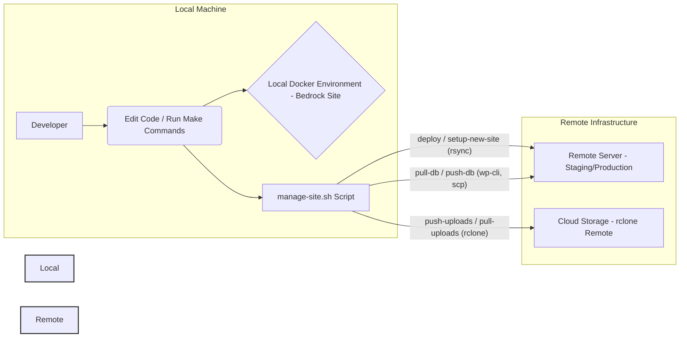

<div align="center">
    <h1>Multi-Site WordPress Docker/Bedrock Environment</h1>
    <!-- Add a relevant logo/icon if available, otherwise omit or use a generic one -->
    <!--  -->
</div>

## Modular Workflow 🚀

This project now uses a modular script workflow for all local, deployment, sync,
and provisioning tasks:

- `scripts/local/site-init.sh` — Create a new local Bedrock site
- `scripts/local/env-switch.sh` — Switch active .env for a site
- `scripts/provision/provision-cyberpanel.sh` — Provision CyberPanel/Hetzner
  server
- `scripts/deploy/deploy.sh` — Deploy code to remote server
- `scripts/sync/sync-db.sh` — Sync database (push/pull)
- `scripts/sync/sync-uploads.sh` — Sync uploads (push/pull)
- `scripts/sync/rclone-gui.sh` — Launch rclone web GUI
- `scripts/provision/kuma-monitor.sh` — Kuma monitoring integration
- `scripts/deploy/jenkins/Jenkinsfile` — Jenkins CI/CD pipeline

**Usage Examples:**

```sh
# Create a new local site
./scripts/local/site-init.sh mysite --port=8001

# Switch environment
./scripts/local/env-switch.sh mysite staging

# Provision server
./scripts/provision/provision-cyberpanel.sh mysite.com

# Deploy code
./scripts/deploy/deploy.sh mysite staging

# Sync database
./scripts/sync/sync-db.sh mysite staging push   # push local → remote
./scripts/sync/sync-db.sh mysite staging pull   # pull remote → local

# Sync uploads
./scripts/sync/sync-uploads.sh mysite staging push
./scripts/sync/sync-uploads.sh mysite staging pull

# Launch rclone GUI
./scripts/sync/rclone-gui.sh

# Kuma monitoring
./scripts/provision/kuma-monitor.sh add mysite.com
```

## Overview ⏩️

This project provides a Docker-based development environment designed to manage
multiple WordPress sites using the Bedrock boilerplate. It features:

- **Shared Database:** A single MySQL container serves all local sites.
- **Site Template:** Easily create new Bedrock sites using a pre-configured
  template.
- **Unified Management Script (`scripts/manage-site.sh`):** A powerful script to
  handle:
  - Initial remote site setup (WordPress installation, `.env` configuration).
  - Code deployment from local to remote servers (using `rsync`).
  - Database synchronization (push/pull) between local and remote.
  - Uploads synchronization (push/pull) using `rclone` and a configured cloud
    storage remote.
- **Makefile:** Simplifies common local Docker operations (start/stop sites, run
  commands).

**High-Level Workflow:**



This README aims to be comprehensive, guiding you through setup, usage, and the
underlying concepts.

## Table of Contents 📄

- [Project Structure](#project-structure-)
- [Requirements](#requirements-%EF%B8%8F)
- [Documentation](#documentation-)
- [Further Automation Ideas](#further-automation-ideas-)
- [Getting Help](#getting-help-)

## Documentation 📖

Detailed documentation is available in the `docs/` directory:

- **[Core Concepts & Tools Explained](./docs/concepts.md):** Understand Docker,
  Bedrock, Composer, WP-CLI, Make, rsync/rclone/jq, and the project scripts.
- **[Local Development](./docs/local-development.md):** Covers initial setup,
  creating new local sites (`create-site.sh`), and using the Makefile for common
  tasks.
- **[Deployment & Remote Management](./docs/deployment.md):** Details remote
  server setup, the full deployment workflow example, and using the
  `manage-site.sh` script for deployment and data synchronization.
- **[Automated Provisioning](./docs/provisioning.md):** Explains the
  `scripts/provision-cyberpanel-bedrock.sh` script for setting up
  CyberPanel/Cloudflare infrastructure.
- **[Configuration Details](./docs/configuration.md):** Describes the core
  configuration, site template structure, and container naming conventions.
- **[Default Installed Plugins](./docs/plugins.md):** Lists the plugins included
  in the site template.
- **[Security Best Practices](./docs/security.md):** Recommendations for
  securing your environment and sites.
- **[Troubleshooting Guide](./docs/troubleshooting.md):** Solutions for common
  problems.
- **[Automated CI/CD](./docs/deployment.md#automated-cicd-with-github-actions-️):**
  Explains the GitHub Actions workflow for automated testing and deployment.

## Project Structure 🏗️

```
.
├── core/                     # Shared Docker configurations (DB, Base Image)
│   ├── .env.example          # Example for core DB password
│   ├── docker-compose-db.yml # Defines shared DB service & network
│   └── Dockerfile            # Base PHP/Nginx image for all sites
├── scripts/                  # Utility and deployment scripts
│   ├── manage-site.sh        # Unified deploy, sync & setup script (Run Locally)
│   ├── sync-config.sample.json # Sample config for manage-site.sh
│   └── dumps/                # Default location for temporary DB dumps
├── websites/                 # Contains individual site directories
│   ├── testsite/             # Example site created by create-site.sh
│   │   ├── .env              # Active environment file (managed by switch-env.sh)
│   │   ├── .env.development  # Dev settings (DB points to shared Docker DB)
│   │   ├── .env.production   # Prod settings (DB points to remote DB)
│   │   ├── .env.staging      # Staging settings (DB points to remote DB)
│   │   ├── docker-compose.yml # Site-specific Docker services (app, webserver)
│   │   ├── nginx.conf        # Nginx config for the site's webserver container
│   │   ├── uploads.ini       # PHP upload settings for the site's app container
│   │   └── www/              # Bedrock installation for this site
│   │       ├── composer.json
│   │       ├── config/
│   │       └── web/          # Public web root (contains index.php, app/, wp/)
│   └── template/             # Template for creating new sites
│       ├── .env.*.tpl        # Template environment files
│       ├── .env.example      # Explains site .env variables
│       ├── docker-compose.yml.tpl
│       ├── nginx.conf.tpl
│       ├── uploads.ini
│       └── www/              # Base Bedrock installation (run composer install here first)
├── .env.example              # Top-level example (not typically used)
├── .gitignore
├── create-site.sh            # Script to create & initialize NEW LOCAL sites
├── Makefile                  # Shortcuts for LOCAL development tasks
├── nginx.conf                # Default Nginx config (referenced by site configs)
├── README.md
└── switch-env.sh             # Script to switch active LOCAL .env for a site
```

## Requirements ⏸️

**Local Machine:**

- [Docker](https://docs.docker.com/get-docker/) &
  [Docker Compose](https://docs.docker.com/compose/install/)
- [Composer](https://getcomposer.org/)
- `git`
- `curl` (Used by `create-site.sh` for salts)
- `openssl` (Used by `create-site.sh` for passwords/salts)
- `make` (Optional, for using the Makefile shortcuts)
- `jq` (Required by `manage-site.sh`)
- `rclone` (Required by `manage-site.sh` for uploads sync)
- `rsync` (Required by `manage-site.sh` for deployment)
- `ssh` & `scp` clients (Required by `manage-site.sh`)
- Scripts should be executable: `chmod +x *.sh scripts/*.sh`

**Remote Server (for Deployment/Sync):**

- SSH access (key-based authentication highly recommended)
- `sudo` access (often needed for setting permissions, running commands as web
  user)
- `git`
- `composer`
- `wp-cli` (Installed globally, e.g., in `/usr/local/bin/wp`)
- `rsync`
- `rclone` (If syncing uploads directly to/from the server filesystem via cloud)
- Correct PHP version (matching your Bedrock requirements, e.g., PHP 8.1+)
- Web server (Nginx/Apache/OpenLiteSpeed) configured to serve the Bedrock site
  (document root should be `<remote_path>/web/`)
- Database server (MySQL/MariaDB)

## Further Automation Ideas 💡

- **CI/CD Integration:** Trigger `manage-site.sh deploy staging` on pushes to a
  `develop` branch, and `deploy production` on merges to `main`.
- **Automated Testing:** Integrate PHPUnit/Codeception tests into the `Makefile`
  or CI/CD.
- **Deployment Hooks:** Enhance `manage-site.sh` with explicit
  pre/post-deployment hooks for tasks like cache clearing (`wp cache flush`),
  database migrations, or service restarts (PHP-FPM).
- **Theme/Plugin Scaffolding:** Create scripts or Make targets for quickly
  setting up new custom themes or plugins based on starters.
- **Enhanced Local Setup Script:** A master script or Make target to automate
  the entire initial local setup (cloning, core composer install, DB setup,
  first site creation).
- **Local Health Checks:** Add a `make health-check site=<name>` target to
  verify local container status, site responsiveness, and DB connectivity.
- **Automated Backups:** Implement a `make backup site=<name> env=<environment>`
  target using `manage-site.sh` to pull data and sync uploads to a backup
  location (local or cloud). Could be scheduled with `cron`.
- **Dependency Update Checker:** A script/target
  (`make check-updates site=<name>`) to report available
  Composer/WordPress/plugin updates using `composer outdated` and WP-CLI
  commands.
- **Staging Cloning:** Add a `manage-site.sh <site> clone-production-to-staging`
  action to replicate the production database and uploads to the staging
  environment, including URL updates via `wp search-replace`.
- **WP-CLI Alias Generation:** A script to generate a `wp-cli.yml` with aliases
  based on `scripts/sync-config.json` for easier remote command execution.
- **Secrets Management Integration:** (Advanced) Explore integrating tools like
  HashiCorp Vault or cloud provider secrets managers for handling sensitive
  credentials instead of plain text files.

## Getting Help 🆘

- Run `make help` for local Makefile commands.
- Run `./create-site.sh --help` for local site creation options.
- Run `./scripts/manage-site.sh` (no args) or check its comments for usage.
- Consult the `sync-config.sample.json` for configuration guidance.
- Refer to documentation for Bedrock, Docker, WP-CLI, rclone, jq.
- Check the Roots Discourse for Bedrock questions: https://discourse.roots.io/
