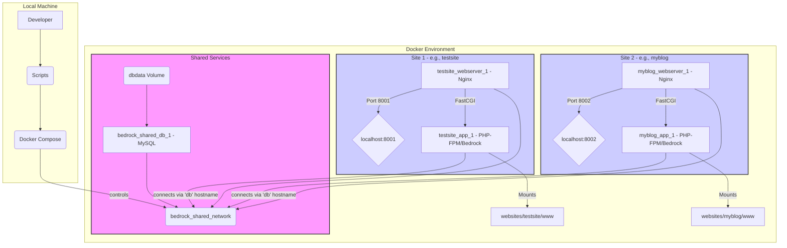
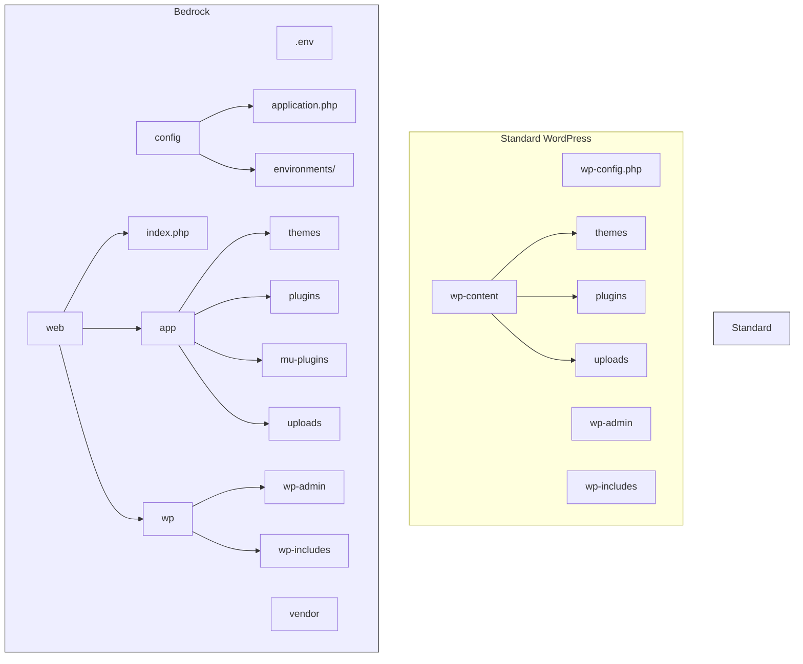

# Core Concepts & Tools Explained 📖

Understanding these tools is key to using this environment effectively.

## Docker & Docker Compose

- **Docker:** Packages applications and dependencies into isolated
  **containers**, ensuring they run consistently everywhere.
- **Dockerfile (`core/Dockerfile`):** Blueprint for building the PHP/Nginx
  **image** used by all site containers.
- **Docker Compose:** Defines and runs multi-container applications using YAML
  files.
  - `core/docker-compose-db.yml`: Defines the shared MySQL (`db`) service and
    network (`bedrock_shared_network`).
  - `websites/<site_name>/docker-compose.yml`: Defines site-specific services
    (`app` for PHP/WordPress, `webserver` for Nginx) and connects them to the
    shared network and database.
- **Volumes (`dbdata`):** Persist database data outside the container.
- **Networks (`bedrock_shared_network`):** Allow containers (like `app` and
  `db`) to communicate using service names (e.g., `db:3306`).

**Architecture Diagram:**

## Bedrock (WordPress Boilerplate)

- **Bedrock:** A modern WordPress boilerplate by Roots.io.
- **Key Features:**
  - **Improved Folder Structure:** Separates WordPress core (`web/wp/`) from
    your code (`web/app/`).
  - **Composer:** Manages WordPress core, plugins, and themes.
  - **`.env` Files:** Manages configuration (database, URLs, salts) outside
    version control. See `websites/template/.env.example`.
  - **Environment Config:** Loads specific PHP settings (e.g.,
    `www/config/environments/development.php`) based on `WP_ENV` in the `.env`
    file.

**Directory Structure Comparison:**

## Composer (PHP Package Manager)

- **Composer:** Manages PHP dependencies. Bedrock uses it for WordPress core,
  plugins (via [WPackagist](https://wpackagist.org/)), themes, and libraries.
- **`composer.json`:** Defines project dependencies. Template defaults:
  `websites/template/www/composer.json`.
- **`composer.lock`:** Records exact installed versions for consistency.
- **`vendor/`:** Where dependency code is downloaded (usually ignored by git).
- **Commands:**
  - `composer install`: Installs based on `composer.lock` (or `.json`). Use
    `--no-dev` for production/staging.
  - `composer update`: Updates to latest allowed versions, updates
    `composer.lock`.
  - `composer require <package>`: Adds and installs a new dependency.

## WP-CLI (WordPress Command Line)

- **WP-CLI:** Manages WordPress installations via the command line.
- **Usage Here:** Installed in the `app` container. Run commands via
  `docker-compose ... exec app wp ...`. Used extensively by deployment and sync
  scripts for remote database operations and installation checks.
- **Examples:** `wp core install`, `wp plugin activate`, `wp db export/import`,
  `wp search-replace`.

## rsync, rclone & jq (Sync/Utility Tools)

- **rsync:** A fast, versatile file copying tool. Used by `manage-site.sh`'s
  `deploy` and `setup-new-site` actions to efficiently transfer project files
  (excluding `.env`, `.git`, etc.) to the remote server. Requires installation
  on both local and remote machines.
- **rclone:** A command-line program to manage files on cloud storage (S3,
  Google Drive, etc.). Used by `manage-site.sh` to sync the `uploads` directory
  between local, cloud storage, and potentially the remote server. Requires
  local installation and configuration (`rclone config`) on both local machine
  and the remote server.
- **jq:** A lightweight command-line JSON processor. Used by `manage-site.sh` to
  safely parse site and environment details from `scripts/sync-config.json`.
  Requires local installation.

## Project Scripts

- **`create-site.sh`:** (Local Use) Automates creating a new site directory and
  configuration files from the `websites/template/`. Includes options for local
  DB creation, WP installation, etc. See
  [Creating a New Local Site](../docs/local-development.md#creating-a-new-local-site-🚀).
- **`switch-env.sh`:** (Local Use) Copies the appropriate environment file
  (e.g., `.env.development`) to `.env` for a local site, allowing easy
  configuration switching.
- **`scripts/manage-site.sh`:** (Local Use for Remote Actions) The primary
  script for deploying code and synchronizing data (database, uploads) between
  your local environment and remote environments (staging/production), and for
  initial remote site setup. Uses `rsync`, SSH, SCP, WP-CLI, and `rclone`,
  reading connection details from `scripts/sync-config.json`. See
  [The `manage-site.sh` Script](../docs/deployment.md#the-manage-sitesh-script-deployment--sync-%EF%B8%8F).
