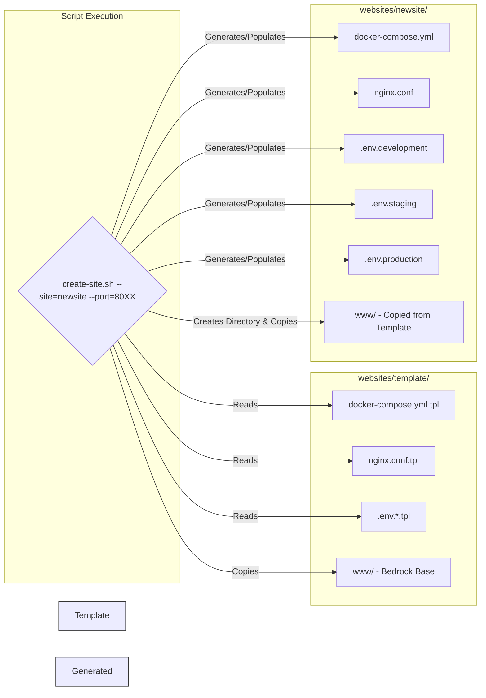

# Configuration Details ⚙️

This section details the specific configuration files and structures within the
project.

## Core Configuration (`core/`)

- `docker-compose-db.yml`: Defines the shared MySQL service
  (`bedrock_shared_db`) and the shared Docker network
  (`bedrock_shared_network`). It relies on the `MYSQL_ROOT_PASSWORD` variable
  set in `core/.env`.
- `Dockerfile`: This is the blueprint for the base PHP-FPM/Nginx Docker image
  used by all individual site containers (`app` and `webserver`). Customize this
  file if you need different PHP extensions or base server configurations across
  all sites.
- `.env.example`: Provides the template for `core/.env`, which must contain the
  `MYSQL_ROOT_PASSWORD` for the shared database. Remember to add `core/.env` to
  your `.gitignore`.

## Site Template (`websites/template/`)

This directory serves as the foundation for new local sites created using the
`create-site.sh` script.

**Template Usage by `create-site.sh`:**

- **`.tpl` Files:** Files like `docker-compose.yml.tpl` and `nginx.conf.tpl`
  contain placeholders (e.g., `%%SITE_NAME%%`, `%%PORT%%`) that are replaced
  with site-specific values during the execution of `create-site.sh`.
- **`.env.*.tpl` Files:** Templates for the different environment configuration
  files (`.env.development`, `.env.staging`, `.env.production`). The
  `create-site.sh` script generates unique WordPress salts and populates these
  templates when creating a new site.
- **`.env.example`:** Explains the purpose of each variable expected within a
  site's `.env` file (e.g., `DB_NAME`, `DB_USER`, `WP_HOME`, `WP_SITEURL`).
- **`www/`:** Contains the base Bedrock installation structure.
  - `composer.json`: Defines the default WordPress version, plugins, and themes
    for new sites. Run `composer install` within `websites/template/www/` after
    cloning the main project repository or whenever you update these defaults.
  - `config/`: Bedrock's configuration directory, including `application.php`
    and environment-specific files (`environments/development.php`, etc.).
  - `web/`: The public document root for the WordPress site, containing
    `index.php` and the `app/` directory (for themes, plugins, mu-plugins) and
    eventually the `wp/` directory (WordPress core, managed by Composer).
- **`rclone` Configuration:** While not part of the template structure itself,
  remember that `rclone` needs to be configured locally (and potentially
  remotely) for the `push-uploads`/`pull-uploads` commands in `manage-site.sh`
  to function. Refer to the
  [official rclone documentation](https://rclone.org/docs/) for setup
  instructions specific to your chosen cloud storage provider.

## Container Naming

Understanding the container naming convention helps when using Docker commands
directly.

- **Local Site Containers:** Containers for individual sites follow the pattern
  `<site_name>_<service_name>_1`.
  - Example: For a site named `myblog`, you'll have `myblog_app_1`
    (PHP-FPM/WordPress) and `myblog_webserver_1` (Nginx).
  - These are defined in the site-specific
    `websites/<site_name>/docker-compose.yml` file.
- **Shared Local Database Container:** The single MySQL database container is
  named `bedrock_shared_db_1`.
  - This is defined in `core/docker-compose-db.yml`.
- **Shared Network:** All site containers and the database container connect to
  the `bedrock_shared_network`. This allows site `app` containers to reach the
  database using the hostname `db` (the service name defined in
  `core/docker-compose-db.yml`).
