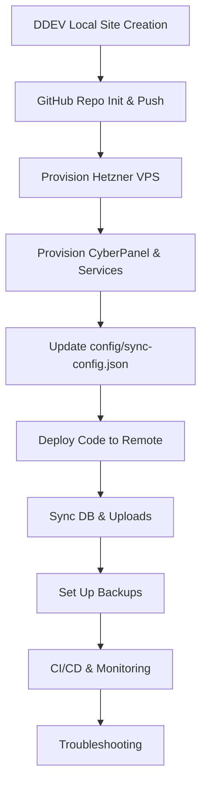

# Full Example Workflow: Bedrock Site Creation to Production (DDEV Edition)

**Note:** All local site creation and provisioning now use
[DDEV](https://ddev.readthedocs.io/en/latest/). DDEV manages Docker containers,
networking, and environment settings for you. Remote provisioning, deployment,
sync, backup, and monitoring workflows remain unchanged.

---

## 1. Create a New Local Site (with DDEV)

```sh
# Prerequisites: DDEV and Composer installed
ddev --version
composer --version

# 1. Create a new site directory
cd /home/nadbad/Work/Wordpress
mkdir site
cd site

# 2. Configure DDEV for WordPress with Bedrock's docroot
ddev config --project-type=wordpress --docroot=web --create-docroot

# 3. Install Bedrock via Composer
composer create-project roots/bedrock .

# 4. Start the DDEV project
ddev start

# 5. Provision WordPress with WP-CLI
ddev wp core install --url=https://site.ddev.site --title="My Site" --admin_user=admin --admin_email=admin@example.com --admin_password=securepassword

# 6. Launch the site in your browser
ddev launch

# Access WP-Admin at https://site.ddev.site/wp/wp-admin
```

---

## 2. Initialize Git and Push to GitHub

```sh
cd /home/nadbad/Work/Wordpress/site
git init
git add .
git commit -m "Initial commit"
# Create a new repo on GitHub (manually or with script)
../../scripts/local/create-github-repo.sh site
git remote add origin <github-repo-url>
git push -u origin main
```

---

## 3. Provision the Remote Server

After provisioning, view collected project metadata:

```sh
./scripts/show-project-info.sh
```

### a. Provision Hetzner VPS

See [docs/hcloud.md](./hcloud.md) for full installation and setup instructions.

```sh
./scripts/provision/provision-hetzner.sh
```

- **Expected Output:** Server ID and IP address (e.g.,
  `ID: 123456, IP: 95.217.XX.XX`)
- SSH into the server: `ssh root@<server-ip>`

---

### b. Provision CyberPanel and Services

```sh
./scripts/provision/provision-cyberpanel.sh <your_domain>
```

---

### c. Set Up Domain and Subdomain DNS (Cloudflare CLI)

See [docs/cloudflare.md](./cloudflare.md) for full usage and options.

---

## 4. Update Sync Config

Edit `config/sync-config.json` and add your new site and remote environments.

---

## 5. Deploy Code to Remote

```sh
./scripts/deploy/deploy.sh site staging
./scripts/deploy/deploy.sh site production
```

---

## 6. Sync Database and Uploads

```sh
./scripts/sync/sync-db.sh site staging push
./scripts/sync/sync-db.sh site staging pull
./scripts/sync/sync-uploads.sh site staging push
./scripts/sync/sync-uploads.sh site staging pull
```

---

## 7. Set Up Backups

See [Backup & Restore Usage](./usage-backup.md) for full details.

```sh
./scripts/sync/backup.sh site production
./scripts/sync/restore.sh site production --date=YYYYMMDD-HHMMSS
```

---

## 8. Set Up CI/CD and Monitoring

- Register Jenkins pipeline: `./scripts/ci/jenkins-connect.sh ...`
- Register Kuma monitor: `./scripts/monitoring/kuma-register.sh ...`

---

## 9. Troubleshooting

- See [docs/troubleshooting.md](./troubleshooting.md) for common issues and
  solutions.
- **DDEV Tips:**
  - If port conflicts occur, use `ddev config --webserver-port=8010`.
  - DDEV manages .env settings internally; customize in `.ddev/config.yaml` if
    needed.
  - Use `ddev import-db` and `ddev export-db` for database syncs.

---

## Mermaid Workflow Diagram



---

**You now have a fully automated, modular workflow from local development to
production, with backups and monitoring—powered by DDEV for local development!**
