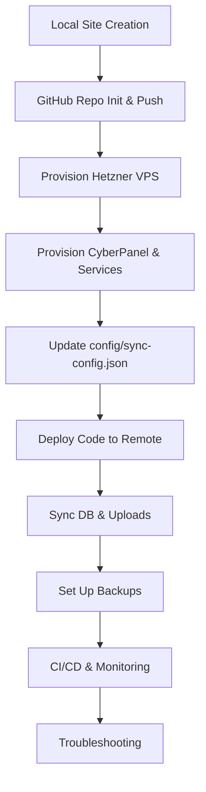

# Full Example Workflow: Bedrock Site Creation to Production

This guide walks you through the entire process of creating, provisioning,
deploying, syncing, backing up, and monitoring a new Bedrock-based WordPress
site using the modular scripts.

---

## 1. Create a New Local Site

```sh
# Create a new site 'myblog' on port 8005
./scripts/local/site-init.sh myblog --port=8005

# Generate .env files (if needed)
./scripts/local/generate-env.sh myblog

# Switch to development environment
./scripts/local/env-switch.sh myblog development

# Start containers
cd websites/myblog && docker-compose up -d

# Access at http://localhost:8005
```

---

## 2. Initialize Git and Push to GitHub

```sh
cd websites/myblog
git init
git add .
git commit -m "Initial commit"
# Create a new repo on GitHub (manually or with script)
../../scripts/local/create-github-repo.sh myblog
git remote add origin <github-repo-url>
git push -u origin main
```

---

## 3. Provision the Remote Server

### a. Provision Hetzner VPS

```sh
# Provision a new Hetzner VPS (requires HETZNER_TOKEN env variable)
./scripts/provision/provision-hetzner.sh myblog-server --ssh-key=<your_ssh_key_name>
```

- This script will create a new server and output its public IP.
- You can SSH into the server once it's ready.

### b. Provision CyberPanel and Services

```sh
# Provision CyberPanel, DNS, DB, OLS, hardening, rclone, logrotate on the new server
./scripts/provision/provision-cyberpanel.sh myblog.com
```

- This script will set up CyberPanel and all required services on the Hetzner
  VPS.

---

## 4. Update Sync Config

- Edit `config/sync-config.json` and add your new site and remote environments
  (staging, production).
- Fill in SSH, DB, rclone, and path details as output by the provisioning
  script.

---

## 5. Deploy Code to Remote

```sh
# Deploy code to staging
./scripts/deploy/deploy.sh myblog staging

# Or to production
./scripts/deploy/deploy.sh myblog production
```

---

## 6. Sync Database and Uploads

```sh
# Push local DB to remote
./scripts/sync/sync-db.sh myblog staging push

# Pull remote DB to local
./scripts/sync/sync-db.sh myblog staging pull

# Push uploads to remote/cloud
./scripts/sync/sync-uploads.sh myblog staging push

# Pull uploads from remote/cloud
./scripts/sync/sync-uploads.sh myblog staging pull
```

---

## 7. Set Up Backups

```sh
# Backup DB and uploads to rclone remote
./scripts/sync/backup.sh myblog production

# Restore from backup
./scripts/sync/restore.sh myblog production --date=YYYYMMDD-HHMMSS
```

---

## 8. Set Up CI/CD and Monitoring

- Register Jenkins pipeline: `./scripts/ci/jenkins-connect.sh ...`
- Register Kuma monitor: `./scripts/monitoring/kuma-register.sh ...`
- Jenkins pipeline will notify Kuma after deploy.

---

## 9. Troubleshooting

- See [docs/troubleshooting.md](./troubleshooting.md) for common issues and
  solutions.

---

## Mermaid Workflow Diagram



---

**You now have a fully automated, modular workflow from local development to
production, with backups and monitoring!**

---

## Step-by-Step Usage Explanation

### 1. Local Site Creation

- Run `./scripts/local/site-init.sh myblog --port=8005` to scaffold a new site.
- Generate .env files and switch to the desired environment.
- Start containers with `cd websites/myblog && docker-compose up -d`.

### 2. GitHub Setup

- Initialize a git repo, commit, and push to GitHub.

### 3. Provision Hetzner VPS

- Run
  `./scripts/provision/provision-hetzner.sh myblog-server --ssh-key=<your_ssh_key_name>`.
- The script will create a VPS and print its IP.
- SSH to the server using the printed IP.

### 4. Provision CyberPanel & Services

- Run `./scripts/provision/provision-cyberpanel.sh myblog.com`.
- This sets up CyberPanel, DNS, DB, OLS, rclone, logrotate, and hardening on the
  Hetzner server.
- The script may prompt for required info (domain, credentials, etc.).

### 5. Update Sync Config

- Edit `config/sync-config.json` with the new site and remote environment
  details (SSH, DB, rclone, paths).

### 6. Deploy Code to Remote

- Deploy to staging or production using
  `./scripts/deploy/deploy.sh myblog staging` or `production`.

### 7. Sync Database and Uploads

- Use the sync scripts to push/pull DB and uploads between local and
  remote/cloud.

### 8. Set Up Backups

- Use `./scripts/sync/backup.sh` and `./scripts/sync/restore.sh` for backups and
  restores.

### 9. Set Up CI/CD and Monitoring

- Register Jenkins and Kuma monitoring as needed.

### 10. Troubleshooting

- Refer to `docs/troubleshooting.md` for common issues and solutions.
