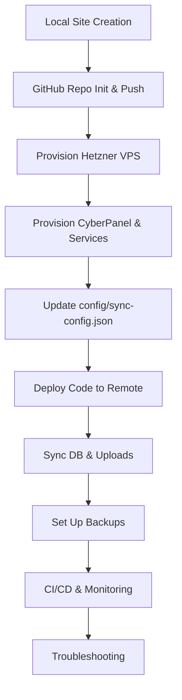

Full Example Workflow: Bedrock Site Creation to Production

**Note:** All scripts now automatically resolve the project root, so you can run
them from any directory. You no longer need to `cd` into the project root before
running scripts.

**Important:**  
After cloning the repo, make all scripts executable (run once):

```sh
find scripts -type f -name "*.sh" -exec chmod +x {} \;
```

This guide walks you through the entire process of creating, provisioning,
deploying, syncing, backing up, and monitoring a new Bedrock-based WordPress
site using the modular scripts.

---

## 1. Create a New Local Site

```sh
# Create a new site 'myblog' on port 8005 (choose directory interactively)
./scripts/local/site-init.sh myblog --port=8005

# Generate .env files (if needed)
./scripts/local/generate-env.sh <site_dir_name>

# Switch to development environment
./scripts/local/env-switch.sh <site_dir_name> development

# Run in dir of project to copy env
cp .env.development .env

# Start containers
cd <parent_dir>/<site_dir_name> && docker-compose up -d

# Install wp
./scripts/local/site-provision.sh

# Access at http://localhost:8005
```

**New:**

- DB_CONTAINER is now dynamic and written to your env files by site-init.sh
  (e.g., `DB_CONTAINER=myblog_db`).
- All provisioning scripts (site-provision.sh, etc.) use DB_CONTAINER from env
  for MySQL and WP-CLI commands.

---

## 2. Initialize Git and Push to GitHub

```sh
cd <parent_dir>/<site_dir_name>
git init
git add .
git commit -m "Initial commit"
# Create a new repo on GitHub (manually or with script)
../../scripts/local/create-github-repo.sh <site_dir_name>
git remote add origin <github-repo-url>
git push -u origin main
```

---

## 3. Provision the Remote Server

After provisioning, view collected project metadata:

```sh
./scripts/show-project-info.sh
```

### a. Provision Hetzner VPS

#### Prerequisite: Configure hcloud CLI Context

See [docs/hcloud.md](./hcloud.md) for full installation and setup instructions.

```sh
./scripts/provision/provision-hetzner.sh
# You will be prompted to:
#   1) Create a new server (interactive)
#   2) Select an existing server (lists all available, then prompts for name)
```

- **Expected Output:** Server ID and IP address (e.g.,
  `ID: 123456, IP: 95.217.XX.XX`)
- You can SSH into the server once it's ready:

```sh
ssh root@<server-ip>
```

#### Fetch Server Info

```sh
hcloud server describe myblog-server
```

#### Troubleshooting

- If you get "context not set", run `hcloud context use my-hcloud`.
- If you get "invalid token", check your API token and context.
- See [docs/hcloud.md](./hcloud.md) for full CLI usage and troubleshooting.

#### Screenshots


---

### b. Provision CyberPanel and Services

```sh
# Provision CyberPanel, DNS, DB, OLS, hardening, rclone, logrotate on the new server
./scripts/provision/provision-cyberpanel.sh <your_domain>
```

- This script will set up CyberPanel and all required services on the Hetzner
  VPS.
- **Expected Output:** Success message, service status, and credentials for
  CyberPanel.

### c. Set Up Domain and Subdomain DNS (Cloudflare CLI)

After your server is provisioned and you have its public IP, set up your domain
and subdomains using the Cloudflare CLI automation script.

#### Using CLI Arguments

```sh
# Add an A record for www.example.com pointing to your server IP
./scripts/provision/cloudflare-dns.sh add --zone example.com --type A --name www --content <server-ip>
# Output: "A record for www.example.com added successfully."

# Add a CNAME record for blog.example.com pointing to target.example.com
./scripts/provision/cloudflare-dns.sh add --zone example.com --type CNAME --name blog --content target.example.com
# Output: "CNAME record for blog.example.com added successfully."

# Remove an A record
./scripts/provision/cloudflare-dns.sh remove --zone example.com --type A --name www
# Output: "A record for www.example.com removed."
```

#### Interactive Mode

Just run without arguments and follow the prompts:

```sh
./scripts/provision/cloudflare-dns.sh
```

See [docs/cloudflare.md](./cloudflare.md) for full usage and options.

---

## 4. Update Sync Config

- Edit `config/sync-config.json` and add your new site and remote environments
  (staging, production).
- Fill in SSH, DB, rclone, and path details as output by the provisioning
  script.

---

## 5. Deploy Code to Remote

```sh
# Deploy code to staging
./scripts/deploy/deploy.sh <site_dir_name> staging

# Or to production
./scripts/deploy/deploy.sh <site_dir_name> production
```

---

## 6. Sync Database and Uploads

```sh
# Push local DB to remote
./scripts/sync/sync-db.sh <site_dir_name> staging push

# Pull remote DB to local
./scripts/sync/sync-db.sh <site_dir_name> staging pull

# Push uploads to remote/cloud
./scripts/sync/sync-uploads.sh <site_dir_name> staging push

# Pull uploads from remote/cloud
./scripts/sync/sync-uploads.sh <site_dir_name> staging pull
```

---

## 7. Set Up Backups

See [Backup & Restore Usage](./usage-backup.md) for full details.

```sh
# Backup DB and uploads to rclone remote
./scripts/sync/backup.sh <site_dir_name> production

# Restore from backup
./scripts/sync/restore.sh <site_dir_name> production --date=YYYYMMDD-HHMMSS
```

---

## 8. Set Up CI/CD and Monitoring

- Register Jenkins pipeline: `./scripts/ci/jenkins-connect.sh ...`
- Register Kuma monitor: `./scripts/monitoring/kuma-register.sh ...`
- Jenkins pipeline will notify Kuma after deploy.

---

## 9. Troubleshooting

- See [docs/troubleshooting.md](./troubleshooting.md) for common issues and
  solutions.

---

## Mermaid Workflow Diagram



---

**You now have a fully automated, modular workflow from local development to
production, with backups and monitoring!**

---

## Step-by-Step Usage Explanation

### 1. Local Site Creation

- Run `./scripts/local/site-init.sh myblog --port=8005` to scaffold a new site.
- DB_CONTAINER will be set dynamically in your env files (e.g.,
  `DB_CONTAINER=myblog_db`).
- All provisioning scripts use DB_CONTAINER from env for MySQL and WP-CLI
  commands.
- Generate .env files and switch to the desired environment.
- Start containers with `cd websites/myblog && docker-compose up -d`.

### 2. GitHub Setup

- Initialize a git repo, commit, and push to GitHub.

### 3. Provision Hetzner VPS

- Run
  `./scripts/provision/provision-hetzner.sh myblog-server --ssh-key=<your_ssh_key_name>`.
- The script will create a VPS and print its IP.
- SSH to the server using the printed IP.

### 4. Provision CyberPanel & Services

- Run `./scripts/provision/provision-cyberpanel.sh myblog.com`.
- This sets up CyberPanel, DNS, DB, OLS, rclone, logrotate, and hardening on the
  Hetzner server.
- The script may prompt for required info (domain, credentials, etc.).

### 5. Update Sync Config

- Edit `config/sync-config.json` with the new site and remote environment
  details (SSH, DB, rclone, paths).

### 6. Deploy Code to Remote

- Deploy to staging or production using
  `./scripts/deploy/deploy.sh myblog staging` or `production`.

### 7. Sync Database and Uploads

- Use the sync scripts to push/pull DB and uploads between local and
  remote/cloud.

### 8. Set Up Backups

- Use `./scripts/sync/backup.sh` and `./scripts/sync/restore.sh` for backups and
  restores.

### 9. Set Up CI/CD and Monitoring

- Register Jenkins and Kuma monitoring as needed.

### 10. Troubleshooting

- Refer to `docs/troubleshooting.md` for common issues and solutions.
