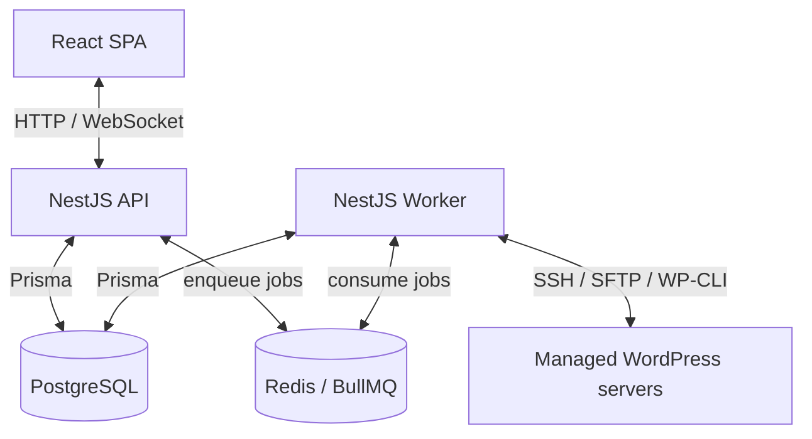

# System Architecture and Feature Map

This guide explains how Bedrock Forge is structured in code, how the frontend
pages map to features, and how backend modules and worker queues cooperate.

---

## System Overview

Bedrock Forge is a single-tenant, self-hosted WordPress operations platform. It
manages Bedrock and standard WordPress environments over SSH without installing
a permanent remote agent.



Production runs as a Docker Compose stack:

- `web`: nginx serving the compiled React app and proxying `/api` and `/ws`.
- `forge`: NestJS API and worker runtime.
- `postgres`: application data, audit records, job state, and encrypted
  credentials.
- `redis`: BullMQ queues, rate limiting, and realtime pub/sub.

---

## Monorepo Layout

```text
bedrock-forge/
├── apps/
│   ├── web/              # React 19 + Vite dashboard
│   ├── api/              # NestJS REST API + WebSocket gateway
│   └── worker/           # NestJS standalone BullMQ processors
├── packages/
│   ├── shared/           # roles, queues, shared types, Zod job schemas
│   └── remote-executor/  # SSH pool, remote executor, credential parser
├── prisma/               # schema, migrations, seed scripts
├── docs/                 # user, development, deployment, and reference docs
├── docker-compose.yml
├── docker-compose.dev.yml
├── turbo.json
└── pnpm-workspace.yaml
```

The workspace is managed with pnpm and Turborepo. Shared packages are imported
by the API, worker, and web app to keep queue names, roles, payload schemas, and
remote execution behavior consistent.

---

## Frontend Structure

`apps/web` is a React/Vite SPA. `App.tsx` defines lazy-loaded routes and wraps
authenticated pages in `AppLayout`.

```text
apps/web/src/
├── App.tsx                  # route table, auth guards, lazy page loading
├── components/
│   ├── layout/              # sidebar, header, app shell
│   ├── ui/                  # shared UI primitives
│   └── crud/                # reusable table/search/pagination states
├── hooks/                   # shared TanStack Query hooks
├── lib/                     # API client, WebSocket client, utilities
├── pages/                   # route-level pages and page feature folders
└── store/                   # Zustand auth and UI state
```

### Page Map

| Route                        | Page                                | Purpose                                                                  |
| ---------------------------- | ----------------------------------- | ------------------------------------------------------------------------ |
| `/login`                     | `LoginPage`                         | Authentication and refresh-token session entry.                          |
| `/dashboard`                 | `DashboardPage`                     | Operational summary, health scores, and attention items.                 |
| `/clients`, `/clients/:id`   | `ClientsPage`, `ClientDetailPage`   | Client records, linked projects, tags, billing context.                  |
| `/servers`, `/servers/:id`   | `ServersPage`, `ServerDetailPage`   | SSH server inventory, health, CyberPanel helpers, linked environments.   |
| `/projects`, `/projects/:id` | `ProjectsPage`, `ProjectDetailPage` | Project inventory and all environment-level operations.                  |
| `/backups`                   | `BackupsPage`                       | Cross-project backup history and job state.                              |
| `/monitors`, `/monitors/:id` | `MonitorsPage`, `MonitorDetailPage` | Uptime, SSL, DNS, keyword, and response history.                         |
| `/lighthouse`                | `LighthousePage`                    | Performance audit queue and history.                                     |
| `/activity`                  | `ActivityPage`                      | Job execution history and logs.                                          |
| `/problems`                  | `ProblemsPage`                      | Cross-project issue feed for maintainers and above.                      |
| `/settings`                  | `SettingsPage`                      | Account, integrations, backup, automation, billing, and plugin settings. |
| `/users`                     | `UsersPage`                         | Admin-only user and role management.                                     |
| `/packages`                  | `PackagesPage`                      | Hosting and support package definitions.                                 |
| `/invoices`, `/invoices/:id` | `InvoicesPage`, `InvoiceDetailPage` | Invoice generation and status tracking.                                  |
| `/tags`                      | `TagsPage`                          | Tag taxonomy for clients and environments.                               |
| `/notifications`             | `NotificationsPage`                 | Notification channels, inbox, and delivery logs.                         |
| `/reports`                   | `ReportsPage`                       | Report configuration, generation, and history.                           |
| `/domains`                   | `DomainsPage`                       | WHOIS and SSL expiry tracking.                                           |
| `/security`                  | `SecurityPage`                      | Security overview, findings, scans, hardening, sessions, and reports.    |
| `/maintenance-windows`       | `MaintenanceWindowsPage`            | Scheduled maintenance window records.                                    |
| `/audit-logs`                | `AuditLogsPage`                     | Admin-only audit trail for write operations.                             |

### Project Detail Features

`pages/project-detail/` contains the project workspace tabs:

- Environments: environment CRUD, server scan/import support, tags, DB
  credential discovery, WP users, and quick login.
- Backups and restore: backup scheduling, backup creation, restore, download,
  and execution logs.
- Sync: clone/push database and files between environments, including safety
  backups and protected data controls.
- Plugins and themes: scan, install, update, activate/deactivate, delete, and
  Composer/custom plugin workflows.
- WP core and tools: WP core checks/updates, cache fixes, debug mode,
  maintenance mode, logs, cron, and cleanup actions.
- Remote ops/files/config: `.env` read/write, environment comparison, safe file
  browsing, text editing, downloads, upload archive creation, notes, and
  variable templates.
- Drift and security: config drift baseline checks and project-specific
  security operations.

### Frontend Data Rules

- Server state uses TanStack Query. Page folders keep focused `api.ts`,
  `hooks.ts`, `types.ts`, and `utils.ts` files where the feature is large
  enough to need them.
- Zustand is limited to auth/session and UI-only state.
- Shared UI primitives live under `components/ui`; page-specific components
  stay near their page folder.
- Realtime job updates use `lib/websocket.ts` and structured job execution
  panels for long-running work.

---

## Backend Structure

`apps/api` is a NestJS REST API with WebSocket support.

```text
apps/api/src/
├── app.module.ts
├── main.ts
├── common/       # guards, decorators, filters, interceptors, DTO helpers
├── config/       # environment-backed config
├── gateways/     # Socket.IO job gateway
├── prisma/       # PrismaService and PrismaModule
└── modules/      # feature modules
```

Feature modules follow the same shape:

```text
modules/<feature>/
├── <feature>.module.ts
├── <feature>.controller.ts
├── <feature>.service.ts
├── <feature>.repository.ts
└── dto/
```

Controllers handle HTTP shape, DTO validation, and role decorators. Services own
business rules and orchestration. Repositories are the Prisma boundary.

### Backend Module Groups

- Identity and access: auth, refresh sessions, MFA setup, users, roles, RBAC.
- Core records: clients, projects, environments, servers, tags, packages.
- WordPress operations: backups, sync, plugin scans, theme scans, WP actions,
  custom plugins, cleanup schedules, plugin update schedules.
- Remote ops: remote `.env`, safe file access, downloads, uploads, resource
  notes, and env variable templates.
- Monitoring and insight: dashboard, monitors, domains, Lighthouse, reports,
  notifications, activity/job executions, problems, audit logs.
- Security: server scans, environment scans, findings, schedules, reports,
  alert settings, and hardening actions.
- Platform settings: billing, SSH key, Google Drive, Cloudflare, system backup
  folder, and generic app settings.

The API registers all BullMQ queues but does not perform SSH work inline. It
creates records, validates payloads, enqueues work, and returns job execution
state to the frontend.

---

## Worker Structure

`apps/worker` is a NestJS standalone process that consumes BullMQ jobs and
executes remote work.

```text
apps/worker/src/
├── worker.module.ts
├── main.ts
├── config/
├── encryption/
├── prisma/
├── processors/
├── scripts/      # PHP/WP helper scripts uploaded on demand
├── services/     # rclone, SSH key, step tracking
└── utils/
```

The worker uses `packages/remote-executor` for SSH/SFTP execution and uses
helper scripts in `apps/worker/scripts/` for workflows that are safer or easier
to run remotely as PHP/WP-CLI actions.

### Queue and Processor Map

| Queue            | Worker responsibility                                                                |
| ---------------- | ------------------------------------------------------------------------------------ |
| `backups`        | Create, restore, schedule, and delete backup files.                                  |
| `plugin-scans`   | Scan plugins and run manual/Composer plugin actions.                                 |
| `plugin-updates` | Run scheduled plugin updates.                                                        |
| `custom-plugins` | Install, update, and remove custom GitHub plugins/themes.                            |
| `theme-scans`    | Scan and manage WordPress themes.                                                    |
| `sync`           | Clone and push database/files between environments.                                  |
| `monitors`       | Run uptime checks and Lighthouse audits.                                             |
| `domains`        | Refresh WHOIS and SSL expiry data.                                                   |
| `projects`       | Provision Bedrock projects and clone from source environments.                       |
| `notifications`  | Deliver notifications to configured channels and inbox records.                      |
| `reports`        | Generate reports and PDFs.                                                           |
| `wp-actions`     | Run debug, maintenance, log, cron, cleanup, core check/update, and fix actions.      |
| `system-backups` | Back up the Forge platform itself.                                                   |
| `security`       | Run server/environment scans, reports, attack watches, alert polling, and hardening. |

Job payload schemas and queue names live in `packages/shared`, so API enqueue
logic and worker processors use the same contract.

---

## Shared Packages

### `packages/shared`

Shared constants and contracts:

- RBAC role constants and helpers.
- Queue names, job type names, WebSocket event names.
- Zod schemas for job payload validation.
- Shared TypeScript types for plugins, themes, notifications, settings,
  monitoring, security findings, and hardening actions.

### `packages/remote-executor`

Remote execution primitives:

- `SshPoolManager`: pooled SSH connections keyed by server.
- `RemoteExecutorService`: command execution, file push/pull, stall handling.
- `CredentialParserService`: regex-based WordPress DB credential parsing from
  `wp-config.php` and Bedrock `.env` files.

---

## Main Data Flows

### Long-Running Job Flow

1. The frontend calls a REST endpoint.
2. The API validates input, checks roles, creates a `JobExecution` record, and
   enqueues a BullMQ job.
3. The worker validates the job payload, loads records from Prisma, performs
   remote SSH/WP work, and writes structured execution-log entries.
4. The worker publishes progress/completion/failure events.
5. The API WebSocket gateway broadcasts updates to authenticated clients.
6. The frontend updates job panels and invalidates affected TanStack Query
   caches.

### Remote SSH Flow

1. The worker resolves server credentials and environment paths.
2. Credentials are decrypted only inside the API/worker process.
3. Commands and helper scripts run over SSH/SFTP.
4. Remote temp helpers are cleaned up after execution where applicable.
5. Results and logs are persisted to PostgreSQL.

---

## Feature Summary

- Infrastructure inventory: servers, clients, projects, environments, tags, and
  packages.
- WordPress operations: backups, restore, sync, plugins, custom plugins, themes,
  WP core, cleanup, cron, debug, maintenance mode, logs, quick login, and file
  operations.
- Monitoring: uptime, SSL, DNS, keyword checks, monitor incidents, domain
  expiry, and Lighthouse audits.
- Security: server and WordPress scans, findings, acknowledgements, schedules,
  reports, alert polling, and hardening actions.
- Business operations: invoices, billing settings, report generation,
  notifications, audit logs, and activity history.
- Platform operations: system backups, Cloudflare and Google Drive settings,
  encrypted credentials, realtime job updates, RBAC, and global search.
