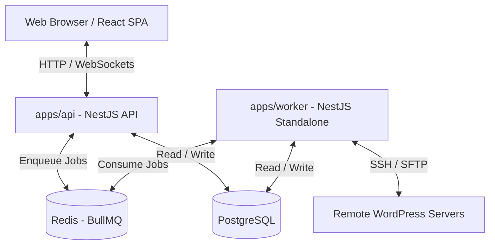

# System Architecture and Features Guide

This guide details the system architecture, project layout, data flow, and feature modules of the Bedrock Forge platform.

---

## 1. System Overview

Bedrock Forge is a multi-tenant monorepo application designed to manage, monitor, synchronize, and secure WordPress environments (specifically Bedrock-based installations) across remote servers.



The codebase is organized as a **pnpm workspace monorepo** managed by **Turborepo**:

*   `apps/web`: Frontend React application.
*   `apps/api`: NestJS REST API and WebSockets server.
*   `apps/worker`: NestJS Standalone worker processing asynchronous queue tasks.
*   `packages/shared`: Shared types, constants, and Zod schemas for contract validation.
*   `packages/remote-executor`: Shared package for remote SSH executions, credential parsing, and SFTP transfers.

---

## 2. Monorepo Project Structure

```text
bedrock-forge/
├── apps/
│   ├── api/                 # NestJS REST API
│   │   ├── src/
│   │   │   ├── common/      # Guards, filters, interceptors, encryption helpers
│   │   │   ├── gateways/     # WebSocket Gateways (real-time progress events)
│   │   │   ├── prisma/      # Prisma client service wrapper
│   │   │   └── modules/     # Domain-specific backend modules (e.g. settings, reports)
│   ├── worker/              # NestJS Standalone Queue Worker
│   │   ├── src/
│   │   │   ├── processors/  # BullMQ processor modules (e.g. sync, backup, security)
│   │   │   └── utils/       # Step tracking, active log helpers
│   └── web/                 # React SPA (Vite + TS + Tailwind CSS)
│       ├── src/
│       │   ├── components/  # Reusable UI component library (shadcn/ui layout primitives)
│       │   ├── pages/       # Route-level components containing modular sub-folders
│       │   │   └── project-detail/
│       │   │       ├── api.ts          # Page-specific backend integrations
│       │   │       ├── hooks.ts        # TanStack Query query/mutation configurations
│       │   │       └── <feature>Tab.tsx # Feature-specific tab layout
│       │   ├── lib/         # API HTTP client (axios wrapper), WebSocket client
│       │   └── store/       # Zustand UI-state-only storage
├── packages/
│   ├── shared/              # API payload Zod schemas, queues list, type exports
│   └── remote-executor/     # SSH client pools, credential parser, script runners
└── prisma/                  # Prisma configuration & schema definitions
```

---

## 3. Backend Architecture (`apps/api` & `apps/worker`)

The backend follows clean architecture principles with a strict segregation of database and business layers.

### The Service-Repository Pattern
To prevent dependency leakage and maintain modularity, direct database access using `PrismaService` is prohibited in controllers and services.
*   **Controller Layer**: Handles HTTP routing, input validation (via class-validator DTOs), request mapping, and role authorization (via `@Roles`).
*   **Service Layer**: Encapsulates business logic, transactional validations, and coordinates actions. It injects specific repositories and other services.
*   **Repository Layer**: The sole boundary communicating with the PostgreSQL database via `PrismaService`.

```text
[Controller] -> [Service] -> [Repository] -> [Prisma / Database]
```

### Async Queue Design
Time-consuming operations (WordPress updates, file system transfers, database backups/synchronizations) are delegated asynchronously to `apps/worker` via **BullMQ**:
1.  **API Side**: Instantiates a `JobExecution` database record in a pending status and enqueues a task to the corresponding Redis queue.
2.  **Worker Side**: Picks up the task. A NestJS `@Processor` validates the payload using a Zod schema from `packages/shared`, sets up execution steps, updates the `JobExecution` status in real-time, and interacts with remote servers using `packages/remote-executor`.

---

## 4. Frontend Architecture (`apps/web`)

The frontend is a React Single Page Application utilizing a modern state management and component structure.

### Domain-Driven Feature Folder Layout
Pages are broken down by domain (e.g., project details features are in `pages/project-detail/`). Each feature folder holds:
*   `api.ts`: Focused API request functions.
*   `hooks.ts`: React Query wrappers managing server-state caching, invalidation triggers, and notification toasts.
*   `utils.ts`: Pure functional utilities isolated from rendering logic (facilitates Vitest unit testing).
*   `components/`: Reusable, localized layout elements.

### Rules of State
*   **Server State**: Always managed using **TanStack Query** (React Query). Never mirror API results inside local component state or Zustand stores.
*   **UI State**: Kept in local component states or lightweight **Zustand** stores (e.g., sidebars, dark-mode flags, and active dialog states).

---

## 5. Shared Packages

### `packages/shared`
Houses shared schemas, constants, and types. This eliminates drift between the API, worker, and frontend.
*   **Validation**: Uses **Zod** to validate job payloads passing through Redis.
*   **Contracts**: Shared TypeScript interfaces for settings configurations (billing, Cloudflare, Google Drive).

### `packages/remote-executor`
Implements server interaction layer.
*   **SSH Connection Pool**: Automatically handles authentication, session reuse, and terminal commands execution.
*   **Credential Parser**: Automatically scans remote `.env` files or `wp-config.php` files to extract MySQL connection strings dynamically.
*   **Safe Path Verifier**: Enforces safety checks to ensure file writes/reads are restricted to the environment's `root_path` or backup directory.

---

## 6. Core Features & Modules

### 🛠️ Projects & Environments
*   **Projects**: Represents a client WordPress website (e.g., `Client A - Production`).
*   **Environments**: Specific deployments of a project (e.g., staging, production).
*   **Sync Engine**: Handles database and file syncing between staging and production environments, with advanced filters to preserve target-specific post types or sanitize client orders post-sync.

### ⚙️ Settings Modules
Decoupled into micro-services:
*   `BillingSettingsService`: Manages localized currency formats.
*   `CloudflareSettingsService`: Handles Cloudflare credentials and automates page rules / zone cache purges.
*   `GdriveSettingsService`: Configures Google Drive connections and schedules backups.

### 📊 Reports & Notifications
*   Generates analytical site health summaries.
*   Distributes real-time reports and alerts across **Slack** and **Google Chat** webhook integrations.

### 🔒 Security & Hardening
*   Monitors file system integrity and scans for suspicious file mutations.
*   Automates WordPress security audits, hardening configurations, and scheduled security checks.

### 📦 Plugins & Backups
*   **Plugins**: Manages public repository plugins and Composer-tracked packages.
*   **Backups**: Automatically takes safety backups prior to critical syncs or plugin upgrades.
