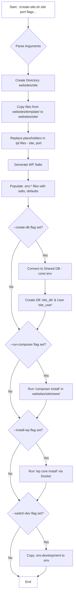

# Local Development 💻

> **Migration Note:** If you previously used `create-site.sh`, `switch-env.sh`,
> or `manage-site.sh`, see [docs/migration.md](./migration.md) for how to use
> the new modular scripts.

This document covers setting up the project locally and managing your local
WordPress sites. ------- ADD AFTER

## Real-World Usage Examples

### Example: Create, Configure, and Start a New Site

```sh
# Create a new site 'myblog' on port 8005
./scripts/local/site-init.sh myblog --port=8005

# Generate .env files (if needed)
./scripts/local/generate-env.sh myblog

# Switch to development environment
./scripts/local/env-switch.sh myblog development

# Start containers
make start site=myblog

# Access at http://localhost:8005
```

### Example: Clone a Site for Staging

```sh
# Create a new site 'myblog-staging' on port 8006
./scripts/local/site-init.sh myblog-staging --port=8006

# Copy .env.production to .env.staging and adjust URLs
cp websites/myblog/.env.production websites/myblog-staging/.env.staging
nano websites/myblog-staging/.env.staging  # Update URLs and DB creds

# Switch to staging environment
./scripts/local/env-switch.sh myblog-staging staging

# Start containers
make start site=myblog-staging
```

## Troubleshooting Tips

- **Containers won't start:** Check `docker ps -a` and `docker logs <container>`
  for errors.
- **Port already in use:** Choose a different port with `--port=XXXX` when
  creating the site.
- **.env not switching:** Make sure to restart containers after switching env:
  `make restart site=mysite`.
- **Composer errors:** Run `composer install` manually in `websites/<site>/www/`
  to debug.
- **Database connection issues:** Check DB credentials in `.env.*` files and
  ensure the shared DB container is running.

## Initial Setup ☣️

**Prerequisites (Local Machine):**

_(You can check if most tools are installed by running `toolname --version` or
`which toolname` in your terminal, e.g., `git --version`, `docker --version`,
`composer --version`, `jq --version`, `rclone version`, `rsync --version`,
`ssh -V`)_

- `git`
- [Docker](https://docs.docker.com/get-docker/) &
  [Docker Compose](https://docs.docker.com/compose/install/) (Verify with
  `docker --version` and `docker compose version`)
- [Composer](https://getcomposer.org/) (Verify with `composer --version`)
- `curl` & `openssl` (Usually pre-installed on Linux/macOS; used by
  `create-site.sh`)
- `make` (Optional, for Makefile shortcuts; verify with `make --version`)
- `jq` (Required by `manage-site.sh`; verify with `jq --version`)
- `rclone` (Required by `manage-site.sh`; verify with `rclone version`)
- `rsync` (Required by `manage-site.sh`; verify with `rsync --version`)
- `ssh` & `scp` clients (Usually pre-installed; required by `manage-site.sh`;
  verify with `ssh -V`)

**Setup Steps:**

1.  **Clone Repository:**
    ```bash
    git clone <your-repo-url> wordpress-with-docker-bedrock
    cd wordpress-with-docker-bedrock
    ```
2.  **Install Bedrock Dependencies in Template:**
    ```bash
    cd websites/template/www
    composer install
    cd ../../..
    ```
    _(Customize `websites/template/www/composer.json` first if needed)._
3.  **Configure Core DB Password:**
    ```bash
    cp core/.env.example core/.env
    ```
    - Edit `core/.env` and set a secure `MYSQL_ROOT_PASSWORD`.
    - **Add `core/.env` to your main `.gitignore` file.**
4.  **Start Shared DB:**
    ```bash
    make start-db
    ```
    _(Run once initially. Needed before creating/running local sites)._
5.  **Configure Deployment/Sync Script (`manage-site.sh`):**
    ```bash
    cp scripts/sync-config.sample.json scripts/sync-config.json
    ```
    - **Crucially, edit `scripts/sync-config.json`** with the correct details
      for _each_ site and _each_ remote environment (staging, production). See
      [Deployment Configuration](../docs/deployment.md#configuration-scriptssync-configjson)
      for details.
    - **Add `scripts/sync-config.json` to your main `.gitignore` file.**
    - Configure `rclone` locally (`rclone config`) so the remote name(s) match
      those used in `sync-config.json`. See
      [rclone docs](https://rclone.org/docs/).
    - Ensure scripts are executable: `chmod +x scripts/*.sh *.sh`.
    - (Highly Recommended) Set up SSH key-based authentication from your local
      machine to your remote servers for passwordless script execution. See
      [Security Best Practices](../docs/security.md#ssh-hardening-).

## Creating a New Local Site 🚀

Use the `create-site.sh` script (or the `make create-site` shortcut) to set up a
new site directory locally based on the template.

**`create-site.sh` Local Setup Flowchart:**



**Example using Make:**

```bash
# Create 'myblog', access at http://localhost:8005
# Automatically: create local DB, install WP locally, run composer, switch to dev env
make create-site site=myblog port=8005 create-db=yes install-wp=yes run-composer=yes switch-dev=yes wp-admin-pass=securepassword
```

**Explanation of Common Options (for `make create-site` or
`./create-site.sh`):**

- `site=<name>` / `<name>`: (Required) Name for the site directory (e.g.,
  `myblog`).
- `port=<number>` / `--port=<number>`: (Required) Local port for Nginx (e.g.,
  `8005`).
- `create-db=yes` / `--create-db`: Auto-create local database & user (uses root
  pass from `core/.env`).
- `install-wp=yes` / `--install-wp`: Auto-run `wp core install` locally
  (requires `create-db=yes`).
- `run-composer=yes` / `--run-composer`: Auto-run `composer install` locally.
- `switch-dev=yes` / `--switch-dev`: Auto-switch to `.env.development`.
- `wp-admin-pass=<pass>` / `--wp-admin-pass=<pass>`: Set local WP admin password
  if `install-wp=yes`.

_Run `make help` or `./create-site.sh --help` for all options._ _The script
generates unique salts for `.env.development`, `.env.staging`,
`.env.production`._

**After Local Site Creation:**

1.  **Review `.env.*` Files:** Check `websites/<new_site_name>/.env.*`. You'll
    need accurate DB credentials and URLs for staging/production before using
    `manage-site.sh` to set up or deploy remotely.
2.  **Start Containers (if needed):** If you didn't use options that start
    containers, run: `make start site=<new_site_name>`.
3.  **Access Site:** Visit `http://localhost:<port>` and
    `http://localhost:<port>/wp-admin`.
4.  **Update `sync-config.json`:** Add entries for your new site and its remote
    environments if you plan to deploy/sync it. See
    [Deployment Configuration](../docs/deployment.md#configuration-scriptssync-configjson).

## Local Development Usage (Makefile) 💻

The `Makefile` provides shortcuts for **local development tasks only**. Run
`make help` for a full list.

```bash
# Start/Stop Core DB (Run 'start-db' once initially)
make start-db
make stop-db

# Create a new LOCAL site (interactive prompts if needed)
./scripts/local/site-init.sh mysite --port=8001

# Manage LOCAL Site Containers (site=testsite default)
make start site=mysite       # Start mysite's app & webserver containers
make stop site=mysite        # Stop mysite's containers
make restart site=mysite     # Restart mysite's containers
make logs site=mysite        # View logs for mysite's containers
make shell site=mysite       # Get a shell inside mysite's 'app' container

# Manage LOCAL Environment (site=mysite default, env=development default)
./scripts/local/env-switch.sh mysite staging # Switch to .env.staging
make restart site=mysite                    # IMPORTANT: Restart after switching env

# Run Commands in LOCAL Containers (site=mysite default)
make composer cmd="update" site=mysite # Runs 'composer update' in mysite's app container
make wp cmd="plugin list" site=mysite  # Runs 'wp plugin list' in mysite's app container

# Cleanup (Local)
make clean-dumps # Removes local DB dump files from scripts/logs/
```
