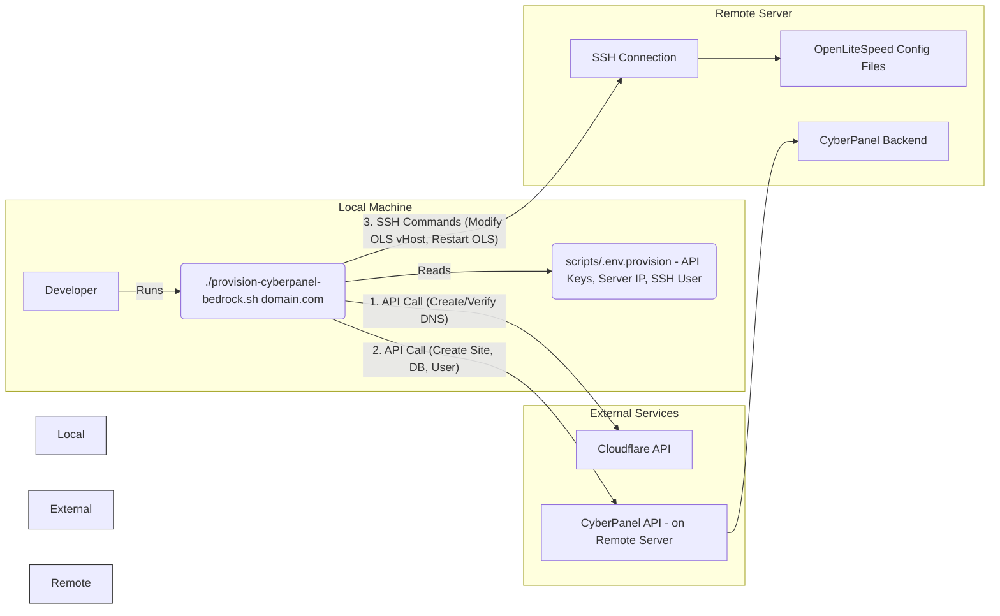

# Automated Provisioning with `provision-cyberpanel-bedrock.sh` 🤖

This script helps automate the setup of the necessary infrastructure on a remote
server running CyberPanel with OpenLiteSpeed, including Cloudflare DNS
integration.

## Overview

The `scripts/provision-cyberpanel-bedrock.sh` script performs the following
actions:

- **Cloudflare DNS:** Creates or verifies the A record for the specified domain,
  pointing to the server IP defined in the configuration.
- **CyberPanel Website:** Creates the website within CyberPanel.
- **CyberPanel Database:** Creates a database and user within CyberPanel. It
  will output the credentials if they are newly created.
- **OpenLiteSpeed Configuration:** Adjusts the virtual host configuration for
  Bedrock compatibility:
  - Sets the document root to `<site_root>/web`.
  - Adds necessary rewrite rules for WordPress permalinks.
- **Restart OpenLiteSpeed:** Applies the configuration changes.

**Provisioning Script Interaction Diagram:**



## Prerequisites

Before running the script, ensure the following are configured and available:

**Remote Server:**

- CyberPanel and OpenLiteSpeed installed and running.
- Correct PHP version (e.g., 8.1+) available and configurable via CyberPanel.
- SSH access enabled for the `SSH_USER` defined below (key-based authentication
  highly recommended).
- `sudo` access for the `SSH_USER`.

**Local Machine:**

_(Verify tools are installed: `curl --version`, `jq --version`, `ssh -V`)_

- `curl` installed (for interacting with APIs).
- `jq` installed (for parsing JSON responses).
- SSH client installed and configured for passwordless access to the remote
  server (using keys). See
  [Security Best Practices](../docs/security.md#ssh-hardening-).
- Script is executable: `chmod +x scripts/provision-cyberpanel-bedrock.sh`.

**Cloudflare:**

- An active Cloudflare account managing the domain's DNS.
- A Cloudflare API Token with permissions:
  - `Zone - DNS - Edit` for the relevant zone.
- The Zone ID for the domain.

**Configuration File (`scripts/.env.provision`):**

- Create this file by copying `scripts/.env.provision.example`.
  ```bash
  cp scripts/.env.provision.example scripts/.env.provision
  ```
- Fill in the required variables:
  - `CLOUDFLARE_API_TOKEN`: Your Cloudflare API token (keep this secure!).
  - `CLOUDFLARE_ZONE_ID`: The Zone ID for your domain on Cloudflare.
  - `SERVER_IP`: The public IP address of your CyberPanel server.
  - `SSH_USER`: The username for SSH access to the server (must have `sudo`
    access).
  - `SSH_PORT`: The SSH port (usually 22).
  - `CYBERPANEL_ADMIN_USER`: CyberPanel admin username (usually 'admin').
  - `CYBERPANEL_ADMIN_PASS`: CyberPanel admin password (keep this secure!).
  - `DEFAULT_ADMIN_EMAIL`: Email address for the CyberPanel site owner.
  - `DEFAULT_PHP_VERSION`: Desired PHP version string as seen in CyberPanel
    (e.g., 'PHP 8.1').
- **Security:** **Add `scripts/.env.provision` to your main `.gitignore` file.**
  Never commit this file.

## Usage

Run the script from your local project root, providing the domain name as the
argument:

```bash
./scripts/provision-cyberpanel-bedrock.sh yourdomain.com
```

**Example within Workflow:**

This script is typically run after creating the local site files but before the
initial deployment using `manage-site.sh setup-new-site`.

1.  `make create-site site=mysite ...` (Create local site)
2.  `./scripts/provision-cyberpanel-bedrock.sh mysite.com` (Provision remote
    infrastructure)
3.  Update `scripts/sync-config.json` with DB credentials output by the script.
4.  `./scripts/manage-site.sh mysite setup-new-site production ...` (Deploy code
    and install WP)

**Important Notes:**

- The script assumes standard CyberPanel API endpoints and behavior.
- Carefully review the prerequisites and ensure all details in
  `scripts/.env.provision` are correct.
- If the script encounters errors, check the output messages and review the
  CyberPanel/Cloudflare configurations manually.
- **Record the database credentials** (name, user, password) output by the
  script if the database is newly created, as you will need them for
  `scripts/sync-config.json`.
